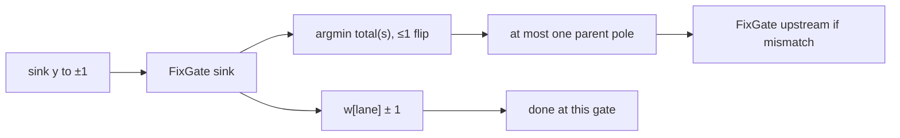

# Random boolean circuit learning: Rust experiment plan

This document specifies **fast, Rust-only experiments** for learning randomly
generated boolean functions defined as **nested pairs of inputs → single boolean
output**. The task is **pure boolean prediction**: given `x ∈ {0,1}^d`, learn
`ŷ ∈ {0,1}` to match the circuit sink `y`.

Learning is **streaming**: one sample `(x_t, y_t)` at a time.

The **learner topology is fixed** at construction: every gate has fixed parents
`(a, b)` with **fan-in `k = 2`** (binary pair gates only). **Only sparse linear
weights** are updated — wiring never changes.

Representation and per-gate cost: [sparse-linear-gate-sizing.md](./sparse-linear-gate-sizing.md).

## Design decision: `k = 2`

**Fan-in is fixed at 2** for v1:

- Matches the DGP (two-input truth-table nodes) and the original nested-pair model.
- Row select by **parent `i8` sign**; gate output **is** the selected row weight (passed downstream as confidence).
- On mismatch, score weight **`±1`** and parent **pole** moves; pick minimal **`total(s)`**; propagate **`pole(sign)`** targets backward.
- **Zero weight padding** (`4 × i8` → one **`u32`** load per gate) — one weight
  per parent-sign **pair** `(sign(a), sign(b))`, not per wire.
- **`k = 4`** remains a documented follow-up if depth-dominated graphs stall after
  profiling; not in v1 scope.

## Learner model: sparse linear, signed `i8` activations

Each gate is a **bias-free sparse linear unit** over **two** parents. Every node
carries a full **`i8` activation** (magnitude = confidence); parents pass that
value downstream — not a single bit.

**Row select:** **`sign(x) = 1`** if **`x ≥ 0`**, else **`0`**. Zero counts as **`1`**
(non‑negative side) so each side holds exactly **128** values: **`[−128, −1]`** vs
**`[0, 127]`**. Table lane **`2·sign(a) + sign(b)`** from parent activations.

Learning uses **local `i8` target propagation** from the sink — **not** full-depth
backprop. When **`activation ≠ target`**, score weight **`±1`** and parent **pole**
moves; parent **`i8` targets** propagate as **`+127`/`−128`** from the selected row.
No batch merge when children disagree — **`targets[parent]` may oscillate** within one
**`observe`**.

### Weights

Store **one `i8` weight per parent-sign pair** — four rows for
`(sign(a), sign(b)) ∈ {0,1}²`:

| Row `(sign(a), sign(b))` | Weight |
|--------------------------|--------|
| `(0, 0)` | `w_00` |
| `(0, 1)` | `w_01` |
| `(1, 0)` | `w_10` |
| `(1, 1)` | `w_11` |

Each gate holds **four** `i8` values packed in one **`u32`**. Forward pass loads
**one row weight**; that value **is** the gate’s **`i8` output** (no threshold inside
the gate).

Sources map **`x[i] ∈ {0,1}`** → **`activations[i] ∈ {−1, +1}`** (strong canonical
polarity). Internal nodes and the sink use the full **`±127`** range as weights evolve.

### Representation (`k = 2`)

| Field | Type | Notes |
|-------|------|-------|
| Weights per gate | **`u32`** (4 × `i8` LE, rows **`00…11`**) | one load; lane **`2·sign(a)+sign(b)`** |
| Parent indices | **`u8`** each (`a`, `b`) | requires **`N = d + G ≤ 256`** |
| Activations | **`Box<[i8]>`** | one per node; confidence + sign |
| Targets | **`Box<[i8]>`** | desired activation per node during update wave |
| Active row | **`Box<[u8]>`** | **`[G]`**, lane **`0..3`** cached from predict |
| Stream label | **`bool`** | sink **`y`** → **`±1`** target on observe |

Weight extract (parent activations `act_a`, `act_b`):

```text
lane = 2*(act_a >= 0) + (act_b >= 0)
w    = (((packed >> (8*lane)) & 0xFF) as i8)
```

### Per-node / per-gate state

- **Activation** (`i8`, per node): forward value; gate output equals selected row weight.
- **Target** (`i8`, per node): desired activation during the current update wave.
- **Active row** (`u8`, per gate): table lane used in the paired **`predict`** (read-only
  on **`observe`** until next forward pass).

```rust
// Gate index g owns output node id = d + g (sources are nodes 0..d)
struct StreamLearner {
    activations: Box<[i8]>,   // [N]
    targets: Box<[i8]>,       // [N]
    active_row: Box<[u8]>,     // [G]
    weights: Box<[u32]>,      // [G]
    // ...
}
```

**Boolean readout** (metrics / **`predict` return**): **`activation ≥ 0`**. Stream
label **`y`** maps to sink target **`+1`** / **`-1`**.

### `predict` — forward only

Topological sweep:

1. Write source **`i8`** activations from **`x`** (`0 → −1`, `1 → +1`).
2. For each gate `g` with parents `(a, b)` at activations **`act_a`, `act_b`**:
   - **`lane = 2·sign(act_a) + sign(act_b)`** → store in **`active_row[g]`**.
   - Load **`u32`**, **`activations[d+g] = w[lane]`**.
3. Return **`activations[sink] ≥ 0`**.

No weight or target changes in **`predict`**.

### Cost model (observe)

For gate output target **`T`**, parent activations **`act_a`, `act_b`**, and all four
row weights **`w[0..4]`**, define cost to **realize row `s`** (signs **`s_a = s>>1`**, **`s_b = s&1`**):

```text
sign(x)            = 1 if x >= 0 else 0
flip_cost(v, want) = 0                         if sign(v) == want
                   = (-v) as u8                if want == 1      // v < 0 → reach 0
                   = (v as u8) + 1             if want == 0      // v >= 0 → reach −1
input_cost(s)      = flip_cost(act_a, s_a) + flip_cost(act_b, s_b)
weight_cost(s)     = w[s].abs_diff(T)                      // |w[s] − T| as u8
total(s)           = input_cost(s) + weight_cost(s)
```

**`best = min_s total(s)`** — cheapest table row if we could move parents and weights freely.

### `observe` — minimal-step target propagation

**Input:** stream label **`y`**. Use **`activations`**, **`active_row`**, **`weights`**, and
**`targets`** from the paired **`predict`**.

**Mismatch rule:** enqueue / update **only** when **`activation ≠ target`**. If they
are equal, **no** weight change, **no** parent target write, **no** upstream event.

**Init:**

1. **`targets[sink] = if y { +1 } else { -1 }`**.
2. If **`activations[sink] ≠ targets[sink]`**, push **`FixGate(sink_gate)`**.

**Event queue (FIFO):**

| Event | Meaning |
|-------|---------|
| **`FixGate(g)`** | Output **`activation ≠ target`** — nudge **`w[lane]`**; optional single-parent pole. |

**Pole targets:** **`pole(1) = +127`**, **`pole(0) = −128`** (max/min **`i8`**). Used when
propagating to a parent so the child requests a **definite sign** with full confidence.
Stream sink still uses **`±1`** from **`y`**.

**`FixGate(g)`** — let **`n = d + g`**, **`T = targets[n]`**, **`act = activations[n]`**,
**`lane = active_row[g]`**, parents **`a`, `b`**, activations **`act_a`, `act_b`**, weights **`w[0..4]`**:

If **`act == T`**, return immediately (nothing to do).

1. **`s* = argmin total(s)`** over rows with **`sign_mismatches(s) ≤ 1`**.
2. **`w[lane] ± 1`** toward **`T`** only if **`lane == s*`** and **`w[lane] ≠ T`**.
3. If **`sign_mismatches(s*) = 1`**, set **`targets[parent] ← pole(s*)`** on the one
   mismatched internal parent and **enqueue `FixGate(producer(parent))`** on the observe
   worklist (duplicates allowed — multiple children may update the same parent).
4. Drain the worklist until empty so updates **propagate backward** through the graph each
   **`observe`**, not only target writes.

Sources **`0..d-1`**: pole targets are not written.

**Not done:** re-forward within the step, two-parent flips in one handler, or full gradient.



### Supervision

Only the **sink target** comes from the stream (**`y_t`**). All other targets are
derived locally by the propagation rules above. Sink target: **`targets[sink] = ±1`**
from **`y_t`**.

## Motivation

Replace discrete truth-table selection with **`i8` pair-indexed row weights** and
**signed local target propagation** at **`k = 2`**. Parents carry confidence;
observe picks the cheapest move (weight **`±1`** or parent **pole**) toward aligning
row + weight with the **`i8`** target.

## Scope

| In scope | Out of scope (v1) |
|----------|-------------------|
| Standalone experiment crate | `BRegressor`, `BClassifier`, ensemble heads |
| Stream learning (1 sample / step) | Batch learning, replay buffers |
| **`k = 2` fixed**; learnable `i8` weights only | **`k > 2`**, dynamic graph growth, truth-table counters |
| Local target propagation from sink | Full-depth backprop, global loss |
| Random circuit DGP + i.i.d. inputs | Python bindings, JAX baselines |
| Prequential boolean accuracy | Exact DGP wiring recovery, sparse event ingest |
| CSV experiment output | Production API changes |

## Problem statement

### Ground truth (DGP)

Random **binary circuit** over `d` source bits:

1. Sources `x[0..d]`.
2. Internal nodes: random parents **`(a, b)`**, truth table **`T ∈ {0..15}`**.
3. Sink **`y ∈ {0,1}`**.

The DGP uses **truth tables**; the learner uses **pair-indexed `i8` row weights**
with **sign-based row select** and **`i8`** activations —
different representational class.

Stream: i.i.d. `Bernoulli(0.5)` inputs; evaluate DGP → `y_t`.

### Learner (fixed topology, `k = 2`)

Same shape **`(d, depth, width)`** as DGP; fixed **`(left, right)`** per gate;
**four `i8` weights** packed in **`u32`**; fixed sink index.

```
Learner graph (fixed)               What varies during stream
─────────────────────               ─────────────────────────
sources x[0..d] → ±1                —
gate g: (a,b) → w[sign(a),sign(b)]  w_00…w_11; i8 activations/targets
sink                                —
```

### Stream protocol

**No concept drift:** one random DGP (fixed wiring + truth tables) is drawn at run
start and held for all **`T`** steps. Inputs are i.i.d. **`Bernoulli(0.5)`** — the
target function does not change over time.

For each `t = 1, 2, …, T`:

1. **`predict(x_t)`** — forward: **`i8` activations** + **`active_row`**.
2. **`observe(y_t)`** — sink target **`±1`**; enqueue/propagate wherever
   **`activation ≠ target`**; each **`FixGate`** applies one weight **`±1`** or one
   parent **pole** write.

**Primary metrics:**

- **Accuracy after warmup:** fraction correct on steps **`warmup + 1 .. T`**
  (default **`warmup = 16384`**, **`T = 65536`**). Excludes cold-start learning
  from the reported accuracy.
- Steps to 95% prequential cumulative accuracy (diagnostic; includes warmup).

## Topology modes

| Mode | Learner wiring | Purpose |
|------|----------------|---------|
| `independent` | Random DAG, seed ≠ DGP | realistic mismatch |
| `matched` | Same `(left, right)` as DGP | upper bound |

v1 focus: both modes.

## Stream learner

### State

- `topology: FixedCircuit` — immutable `(left, right, sink)`; **`k = 2`**.
- `weights: Box<[u32]>` — **`G`** gates.
- `parents: (Box<[u8]>, Box<[u8]>)` — SoA.
- `activations: Box<[i8]>` — **`N`**, forward values.
- `targets: Box<[i8]>` — **`N`**, persist across steps; overwritten during waves.
- `active_row: Box<[u8]>` — **`G`**, cached lane from predict.
- `gate_of_node: Box<[u8]>` — producer gate per node (`255` = source).
- `event_queue: Vec<...>` (or equivalent growable buffer) — FIFO **`FixGate` / `ParentFeedback`**; **no cap**.
- `t: u64`.

### API

```rust
struct StreamLearner {
    /* ... */
}

impl StreamLearner {
    fn new(topology: FixedCircuit, init: InitConfig) -> Self;
    fn predict(&mut self, x: &[bool]) -> bool;
    fn observe(&mut self, y: bool);
}
```

**Per-step cost:**

- **`predict`:** **`O(G)`** forward (same as before).
- **`observe`:** drain event queue until empty; **`FixGate`** may repeat for the
  same **`g`**; worst-case events **`O(G × fan-out)`** per step.

### Defaults

| Parameter | Value |
|-----------|--------|
| Fan-in | **`k = 2`** (fixed) |
| Sources `d` | **32** |
| Gates `G` | **64–256** (`depth × width`) |
| `N = d + G` | **≤ 256** (`u8` indices) |
| Source activation | **`±1`** from boolean input |
| Weight init | **zero** |
| Gate output | selected row **`w[lane]`** (`i8`) |
| Update step | one weight **`±1`** **or** one parent pole **`±127/−128`** from selected row |
| Sink target | **`y → ±1`** each **`observe`** |
| Target init | **zero** |

## Crate layout

```
crates/boolean-circuit-exp/
  Cargo.toml
  src/
    lib.rs
    circuit.rs        # FixedCircuit: DGP (truth table) + learner (linear k=2)
    dgp.rs            # random DGP + stream; matched-topology helper
    gate.rs           # u32 row weights, sign lane select, minimal-cost update
    learner.rs        # predict / observe + FixGate / ParentFeedback event queue
    metrics.rs        # prequential accuracy, steps-to-threshold
    bin/
      run_exp.rs
```

## Experiment suite

```bash
cargo run --release -p boolean-circuit-exp -- ...
```

CSV under `target/exp/`.

### Experiment A — recovery vs stream length

Higher-complexity circuits; longer streams.

| Setting | Values |
|---------|--------|
| `topology` | `independent`, `matched` |
| `d` | 16, 32 |
| `depth` | 4, 8 |
| `width` | 32, 64 (gates **`G = depth × width`**, skip if **`d + G > 256`**) |
| `T` | 16k, 64k, 256k |
| `n_seeds` | 50 |

**Metrics:** accuracy after warmup, steps to 95%, mean `predict`/`observe` ns.

### Experiment B — scaling depth and circuit size

Fixed **`T = 65536`** (override via CLI):

| Setting | Values |
|---------|--------|
| `depth` | 2, 4, 8, 12 |
| `d` | 16, 32 |
| `width` | 16, 32, 64 |
| `topology` | `independent`, `matched` |

Skip grid points where **`d + depth × width > 256`**.

## Implementation order

| Step | Work | Est. |
|------|------|------|
| 1 | `FixedCircuit` DGP eval (`k=2` TT) + stream generator | ~2 h |
| 2 | Gate: sign lane select + minimal-cost update (weight / parent pole) | ~1.5 h |
| 3 | `StreamLearner`: predict, event queue, **`i8` targets/activations** | ~2 h |
| 4 | `matched` / `independent` topology builders | ~1 h |
| 5 | `run_exp` Experiments A + B | ~2 h |

**Stop early if:** `matched`, `T=4096`, final accuracy not above chance — debug
cost tie-breaks before scaling.

## Engineering for speed

- Preallocate at init; **zero heap alloc** on **`predict`**; event queue may grow on **`observe`** (no cap).
- Gates in **topological order**; parents **`u8`**, weights **`Box<[u32]>`**.
- **`activations` / `targets`**: contiguous **`Box<[i8]>`** — **`2N`** bytes; no bitpack.
- **`k = 2`**: one **`u32`** load; lane from two sign tests; output = selected **`i8`**.
- **`FixGate` cost:** four rows × **`abs_diff`** (filter **`sign_mismatches ≤ 1`**); one weight nudge + optional one parent pole.
- Parent propagate: **`pole(s*_bit) ∈ {+127, −128}`** from **`argmin total(s)`** after move.
- **`observe`:** growable **`EventQueue`**; parent **`i8`** targets may oscillate.
- Saturating **`i8`** adds on weights and targets.
- Parallelize across seeds only (`rayon` optional).

## Success criteria (first milestone)

`matched` topology, `d ≤ 32`, `depth ≤ 4`, `T ≥ 4096`:

- Final accuracy after warmup **> 95%** for a majority of seeds, **or**
- Clear gap over `independent` and over zero-init weights.

A single **`k = 2`** gate passes **`i8`** confidence through row weights; **sign** of
deep compositions must build non-linear structure (e.g. XOR chains).

## Optional follow-ups

- **`k = 4`** ablation (see sizing doc) if depth dominates.
- Structured DGP (XOR chains); measure target oscillation rate on fan-out > 1.
- Holdout stream after fixed `T`.

## Open questions

1. **`predict` then `observe`** required every step (undefined if violated).

## Related

- [sparse-linear-gate-sizing.md](./sparse-linear-gate-sizing.md) — fan-in comparison;
  **`k = 2`** vs **`k = 4`** and padding/load tradeoffs.
- [boolean-circuit-exp-wire-learner-plan.md](./boolean-circuit-exp-wire-learner-plan.md) —
  v2 per-wire learner and Experiment C (v1 vs v2 comparison).
