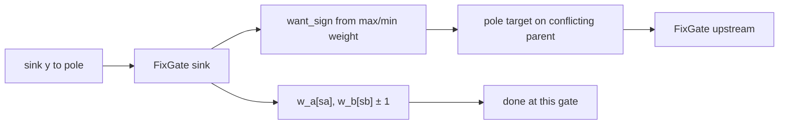

# Boolean circuit exp: v2 per-wire learner plan

Standalone plan for a **v2 (per-wire)** stream learner with independent parent
inputs, to compare against the **v1 (per-pair)** learner in
[boolean-circuit-exp-plan.md](./boolean-circuit-exp-plan.md).

The current **v1 (per-pair)** learner stalls below 100% training accuracy even
with **matched topology**. This document specifies v2 with independent parent
contributions, a concrete update rule, and an experiment to compare the two on
identical streams.

## Why v1 may stall (hypothesis)

| Issue | v1 behavior |
|-------|-------------|
| Sparse weight signal | Only **`w[lane] ± 1`** when **`lane == s*`**; other three rows untouched on that step |
| Indirect parent signal | Parent pole comes from **`argmin total(s)`** over four pair-rows, not from each parent's own weights |
| Output = single row weight | No within-gate summation; deep boolean structure must emerge purely from sign routing |
| One update per `FixGate` | At most one weight nudge **or** one parent pole per event |

v1 is **expressive** (four row weights can encode any 2-input truth table) but
the **learning dynamics** may be too weak or misaligned for fast convergence.

## v2 model: independent inputs, summed output

Same fixed topology as v1: **`k = 2`**, immutable **`(a, b)`**, four **`i8`**
weights per gate in one **`u32`**. Layout differs — **two weights per parent wire**,
not one weight per parent-sign **pair**:

| Lane | Weight | Selected when |
|------|--------|---------------|
| `0` | `w_a0` | `sign(a) = 0` |
| `1` | `w_a1` | `sign(a) = 1` |
| `2` | `w_b0` | `sign(b) = 0` |
| `3` | `w_b1` | `sign(b) = 1` |

**Forward (`predict`):**

```text
sa   = sign(act_a)
sb   = sign(act_b)
sum  = w_a[sa] + w_b[sb]          // i16 internally; store clamped i8 activation
act  = clamp_i8(sum)
out  = (sum >= 0)                 // boolean readout at sink (and for metrics)
```

Cache **`active_lane[g] = (sa, sb)`** (2 bytes or one **`u8`** with **`sa`**
in bit 0, **`sb`** in bit 1) for **`observe`**.

Sources unchanged: **`x[i] ∈ {0,1} → act[i] ∈ {−1, +1}`**.

**Expressivity:** four independent sums
**`{w_a0+w_b0, w_a0+w_b1, w_a1+w_b0, w_a1+w_b1}`** — same 2-input truth-table
capacity as v1 in principle; learning rule is what changes.

## v2 update rule

**Targets are always poles:** **`+127`** (boolean **1**) or **`−128`** (boolean **0**).
No **`±1`** targets anywhere in v2.

```text
pole(1) = +127
pole(0) = −128
bool_target(y) = pole(y)     // stream label → sink target
```

**Supervision:** **`targets[sink] = bool_target(y)`** each **`observe`**.

**No match/mismatch gate.** Every **`FixGate(g)`** runs the full update regardless
of whether **`activations[node]`** already equals **`targets[node]`**. Targets
set the nudge direction and parent **`want_sign`**; they do not skip work.

### Step 1 — nudge activated weights (always, unless saturated)

On every **`FixGate`**, nudge **both** weights selected in the forward pass toward
**`T = targets[node]`**. Skip a weight only when it is already at the **`i8`**
bound in the nudge direction:

```text
step(T) = +1 if T > 0 else −1

nudge(w, T) =
  if step(T) > 0 and w < 127   then w + 1
  if step(T) < 0 and w > −128  then w − 1
  else w                         // at max (+127) or min (−128) — no-op

w_a[sa] ← nudge(w_a[sa], T)
w_b[sb] ← nudge(w_b[sb], T)
```

Both active parent weights are updated on every **`FixGate`** unless saturated.

### Step 2 — backprop conflicting parents (always check)

For each **internal** parent **`p ∈ {a, b}`**, pick the sign that best supports
target **`T`** using **that parent's own** weight pair:

```text
want_sign(T, w0, w1) =
  if T > 0  then argmax(w0, w1)   // target 1 → sign with larger weight
  else      argmin(w0, w1)        // target 0 → sign with smaller weight
```

**Tie-break (fixed):** if **`w0 == w1`**, **`want_sign = sign(act_p)`** — keep the
current parent sign; no pole target write (already aligned by definition).

If **`sign(act_p) ≠ want_sign(T, w_p0, w_p1)`**, set:

```text
targets[p] ← pole(want_sign)      // +127 or −128
```

and **always** enqueue **`FixGate(producer(p))`** (no activation check).

Sources **`0..d−1`**: never write pole targets.

### Event queue

**`observe`:** set sink target, enqueue **`FixGate(sink_gate)`** unconditionally.

Drain FIFO **`FixGate(g)`** until empty. Each handler always runs Step 1 and Step 2.
Multiple children may enqueue the same upstream gate; duplicates allowed.

**Not done in v2:** cost model **`total(s)`**, **`best_row_at_most_one_flip`**,
activation-vs-target early exit, or conditional single-weight nudge.



## v1 vs v2 comparison

| | v1 per-pair | v2 per-wire |
|---|-------------|-------------|
| Weight layout | **`w_00…w_11`** by **`(sign(a),sign(b))`** | **`w_a0,w_a1,w_b0,w_b1`** per parent |
| Forward | **`out = w[lane]`** | **`out = w_a[sa] + w_b[sb]`**, threshold **`≥ 0`** |
| Gate activation | selected row weight | clamped sum |
| Weight update | one **`w[lane]`** if **`lane == s*`** | both active weights every **`FixGate`** (skip only at **`±127`/`−128`**) |
| Parent signal | pole from **`argmin total(s)`**, ≤1 flip | pole from **max/min** of parent's **`(w0,w1)`**; always enqueue upstream if sign conflicts |
| Targets | sink **`±1`**, internal poles on propagate | **always **`+127`/`−128`**; direction only, no skip-on-match |
| Scratch | **`active_row: u8[G]`** | **`active_signs: u8[G]`** (2 bits) |

Shared: fixed topology, streaming protocol, **`i8`** activations/targets, zero
init, sink-only stream label (**`y → pole(y)`** in v2).

## Implementation plan

| Step | Work | Files |
|------|------|-------|
| 1 | Per-wire gate helpers: lane extract, sum, clamp, **`want_sign`**, dual nudge | `gate_wire.rs` |
| 2 | **`StreamLearnerWire`**: `predict` / `observe` / `FixGate` | `learner_wire.rs` |
| 3 | **`LearnerKind`** enum + shared **`run_stream`** wrapper | `metrics.rs`, `lib.rs` |
| 4 | CLI **`--learner pair\|wire`**; CSV column **`learner`** | `run_exp.rs` |
| 5 | Unit tests: single-gate AND/OR/XOR recovery; multi-gate chain | `gate_wire.rs`, `learner_wire.rs` |
| 6 | Experiment C (below) | `run_exp.rs` |

Keep v1 code untouched; v2 is a parallel implementation behind a trait or enum
so both run on the **same DGP, topology, and stream seeds**.

**Weight packing** (same **`u32`**, different lane semantics):

```text
lane_a(b) = 2*0 + b   → w_a0, w_a1  (lanes 0, 1)
lane_b(b) = 2*1 + b   → w_b0, w_b1  (lanes 2, 3)
```

## Experiment C — v1 vs v2 head-to-head

Primary question: does v2 reach **~100% training accuracy** on **matched**
topology where v1 stalls?

**Phase 1 — sanity (run first):**

| Setting | Value |
|---------|-------|
| `topology` | `matched` |
| `d` | 16, 32 |
| `depth` | 2, 4 |
| `width` | 16, 32 |
| `T` | 65536 |
| `warmup_len` | 16384 |
| `n_seeds` | 50 |
| `learner` | `pair`, `wire` |

**Metrics (same as A/B):** accuracy after warmup, accuracy last 100, steps to
95%, mean predict/observe ns.

**Phase 1 success:** v2 **matched** accuracy after warmup **> 95%** on a majority
of seeds **and** clearly above v1 on the same seeds (paired comparison).

**Phase 2 — if phase 1 passes:**

- Add **`independent`** topology (both learners).
- Scale **`depth ∈ {8, 12}`**, **`T ∈ {256k}`** as in experiment A.
- Report **paired delta** per seed: **`acc_wire − acc_pair`**.

**CSV columns (add):** `learner`, `acc_delta_vs_pair` (optional, post-process).

**CLI sketch:**

```bash
cargo run --release -p boolean-circuit-exp -- \
  --experiment c --learner wire --topology matched
cargo run --release -p boolean-circuit-exp -- \
  --experiment c --learner pair --topology matched
```

Or single invocation that runs both learners per seed and writes one row pair.

## Engineering notes (v2)

- **`sum: i16`** per gate during forward (max **254**); clamp to **`i8`** for
  stored activation — matches [sparse-linear-gate-sizing.md](./sparse-linear-gate-sizing.md).
- Weight nudges use **`nudge(w, T)`** above — no-op at **`i8`** min/max, not blind saturating add.
- No re-forward within **`observe`** (same as v1).
- **`FixGate`** never early-exits; **`observe`** always seeds the sink gate.

## Open design choices (resolve during implementation)

1. **Duplicate `FixGate` enqueues:** upstream gate may run many times per
   **`observe`** when fan-out > 1 — acceptable, or dedupe the worklist?
2. **Zero sum, target −128:** nudge active weights down — document in tests.

## Success criteria

**Matched**, **`d ≤ 32`**, **`depth ≤ 4`**, **`T ≥ 65536`:**

- Final accuracy after warmup **≥ 99%** on **≥ 80%** of seeds, **or**
- Mean paired improvement **≥ 10 pp** over v1 on the same seeds.

If v2 also stalls, next levers (out of scope here): re-forward after observe,
stronger parent targets, or **`k = 4`** per-wire.

## Related

- [boolean-circuit-exp-plan.md](./boolean-circuit-exp-plan.md) — v1 learner, DGP, experiments A/B
- [sparse-linear-gate-sizing.md](./sparse-linear-gate-sizing.md) — per-wire vs per-pair layout
