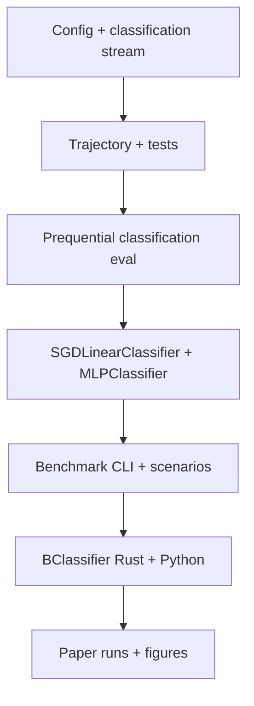

# Plan: Multiclass synthetic classification

## Goal

Extend the drifting binary-input synthetic task from scalar regression to
**multiclass classification**, reusing the same generative form. One shared
input `x`, per-class latent scores, label = `argmax`.

---

## 1. Generative model

### Keep from regression (shared)

| Component | Role |
|-----------|------|
| `input_dag` / `input_state` | Observed features `x_t ∈ {0,1}^d` |
| Input drift (`p_x`, partial resampling) | Same as today |
| Boolean functions `f_j` | Fixed at init, evaluated on `x` |

### Add per class `c ∈ {0, …, K−1}`

Mirror the regression target structure once per class:

```
score_c(x) = b_c + Σ_j  w_{c,j} · g_{c,j} · f_j(x)
y = argmax_c score_c(x)     # tie-break: lowest class index
```

| Per-class state | Regression analogue |
|-----------------|----------------------|
| `b_c` (intercept) | `intercept` |
| `gate_dag_c`, `gate_state_c` | `gate_dag`, `gate_state` |
| `weights_c[j]` | `weights[j]` |

**Design:** shared `f_j`, independent per-class gates, weights, and bias.

This matches “one collection of bias and gates per class” while keeping function
complexity comparable to regression (`n_functions` total, not `K × n_functions`).

**Weights:** each `w_{c,j}` is sampled independently per class from
`Uniform(w_min, w_max)` at init (same distribution as regression `weights[j]`, but
a separate draw for every `(c, j)` pair). Weights do not drift.

### Noise

**Score noise:** add independent `N(0, noise_std²)` to each class score, then take
argmax:

```
noisy_score_c = score_c + ε_c,   ε_c ~ N(0, noise_std²) i.i.d.
y = argmax_c noisy_score_c
```

Uses the same `noise_std` field and dedicated noise RNG as regression. Keeps
scenario parameters interpretable and makes class-boundary drift smooth rather than
abrupt label flips.

### Drift

| Mechanism | Scope |
|-----------|--------|
| Input distribution / partial resample | Shared (unchanged) |
| Gate distribution / partial resample | **Per class**, same `p_g`, `p_sample_*_g` |
| Intercept resample | **Per class**, same `p_b`, `b_min`, `b_max` |

Boolean functions and per-class weights stay fixed (as in regression). Each drift
event is independent per class (same RNG discipline as today, with extra substreams).

---

## 2. Environment module

**File:** `python/binaml/environments/synthetic_drifting_classification.py`

Prefer a sibling module over extending the regression module — keeps regression
artifacts and generator version stable.

### Config

Extend `SyntheticStreamConfig` → `SyntheticClassificationStreamConfig`:

```python
n_classes: int = 3          # new, required for classification
# all existing fields unchanged
schema_version: int = 3     # bump when n_classes is added
GENERATOR_VERSION = "3.0.0-..."  # new fingerprint
```

### Stream API

```python
class SyntheticDriftingClassificationStream:
    def next_sample(...) -> tuple[np.ndarray, int] | (..., metadata)
```

**Metadata** (for oracle/debug): `class_scores`, per-class `gate_state`,
`intercept`, tie indicator, drift flags — analogous to today’s `latent_target`.

### Trajectory

```python
@dataclass
class ClassificationTrajectory:
    X: np.ndarray          # (T, d) uint8
    y: np.ndarray          # (T,) int64, values in [0, K)
    config: ...
    seed: int
    metadata: list[dict] | None
```

NPZ: `y` as `int64`; validate `0 <= y < n_classes`.

### RNG layout

Today: 9 PCG64DXSM substreams from one seed. Classification needs extra streams for:

- Per-class weight vectors, gate DAG init, and intercept init (or one loop over classes from expanded `SeedSequence`)
- Per-class gate sampling / intercept resample RNGs (or shared drift RNG with per-class Bernoulli draws)

Keep the same **deterministic, versioned** contract as regression tests.

### Tests

Mirror `tests/test_synthetic_drifting_regression.py`:

- Config validation (`n_classes >= 2`)
- Reproducibility (same seed → same trajectory)
- Label in range, argmax consistency with metadata scores
- Drift events affect per-class state independently
- Save/load NPZ round-trip

---

## 3. Evaluation

**File:** `python/binaml/evaluation/prequential_classification.py`

### Protocol

```python
class OnlineClassifier(Protocol):
    def predict(self, features: np.ndarray) -> int: ...
    def observe(self, features: np.ndarray, target: int) -> None: ...

OnlineClassifierFactory = Callable[[int, int], OnlineClassifier]  # n_features, n_classes
```

Same predict-then-observe pairing as regression.

### Metrics

- Prequential **accuracy** (only metric)
- Per-step: correct/incorrect instead of squared error
- Warmup exclusion: same pattern as regression CLI

---

## 4. Baseline classifiers

Follow existing regressor patterns in `python/binaml/models/`.

### `SGDLinearClassifier`

Mirror `SGDLinearRegressor`:

- Weight matrix `W ∈ R^{d×K}`, bias `b ∈ R^K`
- Replay batch + mini-batch SGD on **softmax cross-entropy**
- Optional `center_binary_features` (same as linear regressor)
- Factory: `(n_features, n_classes, **params)`

### `MLPClassifier`

Mirror `MLPRegressor`:

- `sklearn.neural_network.MLPClassifier` + `partial_fit`
- Pass `classes=np.arange(n_classes)` on first batch
- Requires `binaml[benchmarks]` extra

### `BClassifier`

Mirror `BRegressor` architecture.

**Rust** (`crates/binaml-core/src/classifier.rs`):

- Same boolean function discovery as `BRegressor`
- Replace scalar head with **multiclass linear head**: per-function weights → `K`-dim logits + intercept vector
- Loss: softmax CE on replay batch (same SGD loop as regressor MSE)
- PyO3: `BClassifierCore` in `bindings/python/src/lib.rs`

**Python** (`python/binaml/models/feature.py` or `classifier.py`):

- Same hyperparameters as `BRegressor` (`learning_rate`, `l2`, `batch_size`, `sgd_steps`, `parent_top_k`, `max_layers`, `max_functions`)
- Factory: `(n_features, n_classes, **params)`
- `predict` → class index (argmax over logits)

**Phasing:** ship Linear + MLP first (Python-only); add `BClassifier` once environment + benchmark loop work.

---

## 5. Benchmark infrastructure

**Package:** `python/binaml/benchmarks/synthetic_streaming_classification/`

Clone the regression layout:

| File | Change vs regression |
|------|----------------------|
| `cli.py` | Load classification scenarios; inject `n_classes` into factories |
| `job.py` | `evaluate_prequentially_classification` |
| `plots.py` | Rolling accuracy, model comparison (not RMSE) |

### Scenario JSON

```json
{
  "name": "default_multiclass",
  "schema_version": 2,
  "n_samples": 1000,
  "seeds": [0, 1, 2, 3, 4],
  "warmup_samples": 100,
  "environment": {
    "schema_version": 3,
    "n_features": 32,
    "n_classes": 3,
    "n_functions": 12,
    "...": "same drift / function params as regression default"
  }
}
```

Start with **`n_classes: 3`**, same feature scales as
`papers/binaml/benchmarks/scenarios/default.json`, plus `features_10x` /
`features_100x` variants.

### `models.json`

```json
{
  "models": [
    { "name": "BClassifier", "factory": "binaml.models:BClassifier", "parameters": { "..." } },
    { "name": "SGDLinearClassifier", "factory": "binaml.models:SGDLinearClassifier", "parameters": { "..." } },
    { "name": "MLPClassifier", "factory": "binaml.models:MLPClassifier", "parameters": { "..." } }
  ]
}
```

Factory loader rule: **`n_features` and `n_classes` come from scenario**, never
from `parameters` (same as today for `n_features`).

### Tests

- `tests/test_benchmark_classification_cli.py` (mirror regression CLI tests)
- `tests/test_online_classifiers.py` (predict/observe contract, simple separable stream)

---

## 6. Paper / docs

Under `papers/binaml/`:

1. New benchmark scenarios in `benchmarks/scenarios/`
2. `benchmarks/models_classification.json` (or extend `models.json` with a task field)
3. `main.tex`: task definition (per-class score + argmax), metrics (accuracy), results table
4. Optional companion note in `papers/synthetic-drifting-regression/` describing the multiclass extension

---

## 7. Implementation order



| Phase | Deliverable |
|-------|-------------|
| **1** | `SyntheticDriftingClassificationStream`, config v3, unit tests |
| **2** | `ClassificationTrajectory`, NPZ I/O, metadata |
| **3** | `OnlineClassifier` + prequential accuracy |
| **4** | `SGDLinearClassifier`, `MLPClassifier` + model tests |
| **5** | Benchmark CLI, scenario JSON, `models.json` entries |
| **6** | `BClassifier` (Rust core + bindings + wrapper) |
| **7** | Paper benchmark runs and write-up |

---

## 8. Decisions to lock before coding

1. **Shared vs per-class boolean functions** — shared `f_j`, per-class gates/weights/bias.
2. **Per-class weights** — `w_{c,j}` sampled independently for each `(c, j)` at init; fixed thereafter.
3. **Noise** — score noise: independent Gaussian perturbation per class, then argmax (`noise_std`).
4. **Default `n_classes`** — 3 for paper parity with simple tables.
5. **Separate vs unified benchmark CLI** — recommend separate `synthetic_streaming_classification` package to avoid breaking regression runs.
6. **BClassifier timing** — after Linear/MLP end-to-end path is green.

---

## 9. Success criteria

- Same scenario + seed → bit-identical trajectories (regression test).
- Oracle that reads metadata `class_scores` gets ~100% accuracy (sanity check).
- Linear/MLP/BClassifier run through benchmark CLI on `default_multiclass` with aggregated accuracy ± stderr over seeds.
- Regression benchmark and artifacts remain unchanged.
