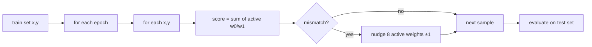

# u8 → bool linear threshold learning: module plan

Minimal batch experiment: learn a **single linear threshold function** over the
8 bits of a `u8`. No graph, no gates — one summing unit with **16 `i8` weights**.

Lives as a **new module** inside `crates/boolean-circuit-exp/`, separate from the
circuit learners (`learner`, `learner_wire`).

## Problem

**Input:** `x: u8`  
**Output:** `y: bool`

**Ground truth (DGP):** draw random per-bit weights and threshold on sign:

```text
bit(i, x) = (x >> i) & 1          // i = 0..7, LSB-first
score(x)  = Σ_i  if bit(i,x) { w1[i] } else { w0[i] }
y(x)      = score(x) >= 0
```

Each `w0[i]`, `w1[i]` is a random `i8` (fixed per seed).

**Learner:** same structure — 16 learnable `i8` weights, zero-init, same forward
pass and sign readout.

**Data:** static train / test split over the 256 possible inputs (or a random
subset with held-out test). Labels from a fixed DGP.

## Why this module

- Smallest end-to-end check of the **per-bit row-weight + sign threshold** idea.
- No topology mismatch, no propagation queue, no parent indices.
- Input space is tiny (`256` points) — full enumeration is cheap.
- Fast to implement and profile before scaling to circuits.

## Scope


| In scope                         | Out of scope                            |
| -------------------------------- | --------------------------------------- |
| `u8` input, 8 bits, 16 weights   | Arbitrary `d`-bit vectors               |
| Static train / test split        | Streaming, online / prequential metrics |
| Multi-epoch batch training       | Python bindings                         |
| Random DGP + train/test accuracy | Circuit graph, gate packing             |
| Optional CLI subcommand          | New crate                               |


## Model

### Weights

```text
w0: [i8; 8]   // contribution when bit i is 0
w1: [i8; 8]   // contribution when bit i is 1
```

16 weights total (~16 bytes). No `u32` packing needed at this scale.

### Forward

```rust
fn score(x: u8, w0: &[i8; 8], w1: &[i8; 8]) -> i32 {
    let mut s = 0i32;
    for i in 0..8 {
        let b = (x >> i) & 1;
        s += if b != 0 { w1[i] as i32 } else { w0[i] as i32 };
    }
    s
}

fn predict(x: u8, ...) -> bool {
    score(x, w0, w1) >= 0
}
```

Use `**i32` accumulator** so 8 saturated `i8` terms cannot wrap unexpectedly.

### Readout convention

- Boolean prediction: `**score >= 0**`
- Training target: `**y → +1` / `!y → -1**`

## Learning rule

**Batch perceptron-style update** over the training set, repeated for `epochs`.

For each sample `(x, y)` in the training batch:

1. Compute `score(x)`.
2. If `sign(score) == sign(target)`: skip.
3. Else, for each bit `i`, nudge the **active row** (the weight actually summed):
  - if `bit(i,x) == 1`: `w1[i] += step toward target`
  - else:               `w0[i] += step toward target`
4. `**step`:** `±1` toward target, saturating at `i8` bounds.

**Epoch loop:** shuffle train indices each epoch (optional but default); stop early
if train accuracy hits 100%.

**Not done:** SGD minibatches (domain is 256), gradients, or per-bit argmin cost.




## Data split

Input space is `**0..=255**` — enumerate once, split by seed:

```rust
pub struct U8Dataset {
    train_x: Vec<u8>,
    train_y: Vec<bool>,
    test_x: Vec<u8>,
    test_y: Vec<bool>,
}
```

**Default split (v1):**

- Shuffle all 256 values with seed.
- **Train:** first `train_frac` (default `0.8` → 204 samples).
- **Test:** remainder (default 52 samples).

Alternative: fixed train = all 256 with bootstrap noise — **not v1**; keep a
proper held-out test set.

**Label generation:** `train_y[i] = dgp.eval(train_x[i])` (deterministic given DGP).

## DGP

```rust
pub struct LinearU8Dgp {
    w0: [i8; 8],
    w1: [i8; 8],
}

impl LinearU8Dgp {
    pub fn random(rng: &mut impl Rng) -> Self;  // uniform i8 per weight
    pub fn eval(&self, x: u8) -> bool;
}
```

**Weight draw:** `rng.gen::<i8>()` for each of 16 weights (full range).

**Degenerate cases:** if all weights are 0, `y` is always `true`. Accept for v1;
optionally reject/resample seeds where labels are constant (follow-up).

## Module layout

Add under `crates/boolean-circuit-exp/src/`:

```
u8_linear/
  mod.rs          # re-exports
  dgp.rs          # LinearU8Dgp
  dataset.rs      # U8Dataset, train/test split
  learner.rs      # U8LinearLearner { w0, w1 }
  metrics.rs      # train/test accuracy (local to module)
```

Wire in `lib.rs`:

```rust
pub mod u8_linear;
pub use u8_linear::{LinearU8Dgp, U8Dataset, U8LinearLearner, U8RunMetrics};
```

### API

```rust
pub struct U8LinearLearner {
    w0: [i8; 8],
    w1: [i8; 8],
}

impl U8LinearLearner {
    pub fn new() -> Self;                              // zero weights
    pub fn predict(&self, x: u8) -> bool;              // forward only
    pub fn fit(&mut self, x: &[u8], y: &[bool], epochs: usize);
    pub fn accuracy(&self, x: &[u8], y: &[bool]) -> f64;
    pub fn weights(&self) -> (&[i8; 8], &[i8; 8]);
}
```

```rust
pub struct U8RunMetrics {
    pub train_accuracy: f64,
    pub test_accuracy: f64,
    pub epochs_run: usize,
    pub train_errors: usize,
    pub test_errors: usize,
}
```

## Experiment runner

Small function in `u8_linear/metrics.rs` (not the streaming `metrics.rs`):

```rust
pub fn run_seed(
    seed: u64,
    train_frac: f64,
    epochs: usize,
) -> U8RunMetrics;
```

Per seed:

1. Build DGP from seed.
2. Build `U8Dataset` from seed + `train_frac`.
3. `learner.fit(&train_x, &train_y, epochs)`.
4. Report train / test accuracy.

## CLI

Add to `run_exp.rs`:

```bash
cargo run --release -p boolean-circuit-exp -- u8-linear \
  --seeds 50 --epochs 100 --train-frac 0.8
```

Grid v1 (minimal):


| Setting      | Values  |
| ------------ | ------- |
| `epochs`     | 10, 100 |
| `train_frac` | 0.8     |
| `n_seeds`    | 50      |


CSV columns: `seed, train_acc, test_acc, train_errors, test_errors, epochs`.

**Success check:** matched structure (learner class equals DGP class), majority of
seeds reach **> 95% test accuracy** within 100 epochs.

## Implementation order


| Step | Work                                                   | Est.    |
| ---- | ------------------------------------------------------ | ------- |
| 1    | `dgp.rs`: random weights, `eval`                       | ~20 min |
| 2    | `dataset.rs`: enumerate 256, seeded split              | ~20 min |
| 3    | `learner.rs`: `predict`, `fit`, `accuracy`, unit tests | ~45 min |
| 4    | `metrics.rs`: `run_seed`, aggregate over seeds         | ~20 min |
| 5    | `run_exp` subcommand + CSV                             | ~30 min |


**Stop early if:** full train set, 100 epochs, test accuracy stays at ~50% — debug
sign / update direction before adding features.

## Tests (in-module)

1. **DGP consistency:** `eval(x) == (score(x) >= 0)` for all 256 `x`.
2. **Trivial DGP:** `w1[0] = 127`, rest zero → `y == (x & 1 != 0)`.
3. **Learner recovery:** fixed DGP, train on all 256, 10 epochs → 100% train acc.
4. **Held-out generalization:** 80/20 split, 100 epochs → test acc > 90%.
5. **Idempotent fit:** correct predictions do not change weights within an epoch.

## Engineering notes

- Preallocate train/test `Vec`s once per seed (max 256 each).
- Bit order: **LSB = bit 0** (`x & 1`); document in module doc comment.
- Saturating arithmetic on weight updates.
- Optional `rayon` over seeds in `run_exp`.
- No heap alloc in `predict`; `fit` may shuffle a `Vec<usize>` index buffer per epoch.

## Related

- [boolean-circuit-exp-plan.md](./boolean-circuit-exp-plan.md) — streaming circuit learner
- [boolean-circuit-exp-wire-learner-plan.md](./boolean-circuit-exp-wire-learner-plan.md) — summed wire variant on graphs

---

## Variant: latest-label memory (`u8_mem`)

Same DGP, data split, and forward **shape** as the base learner — but weights are
`**u8` memory cells**, not accumulated `i8` scores. Each cell stores the **most
recent training label** observed for that `(bit index, bit value)` pair.

### Weights

```text
w0: [u8; 8]   // last target seen when bit i was 0
w1: [u8; 8]   // last target seen when bit i was 1
```

Init: **0** (never seen → contributes 0).

### Target encoding

Store the boolean label directly:

```text
target_u8(y) = 1 if y else 0
```

### Update (overwrite, not nudge)

For each training sample `(x, y)`:

```text
t = target_u8(y)
for i in 0..7:
  if bit(i, x):  w1[i] ← t
  else:          w0[i] ← t
```

Every sample overwrites the 8 active cells. Order within an epoch matters
(“latest” is literal). Still run multiple shuffled epochs; early-stop when train
accuracy hits 100%.

### Forward

Same row select as base; sum in `i32`, center for sign readout:

```rust
fn score_mem(x: u8, w0: &[u8; 8], w1: &[u8; 8]) -> i32 {
    let mut s = 0i32;
    for i in 0..8 {
        let b = (x >> i) & 1;
        s += if b != 0 { w1[i] as i32 } else { w0[i] as i32 };
    }
    s - 4   // 8 cells × {0,1} → midpoint 4
}

fn predict(x: u8, ...) -> bool {
    score_mem(x, w0, w1) >= 0   // equiv. sum >= 4
}
```

### Module additions

```
u8_linear/
  learner_mem.rs   # U8MemLearner { w0: [u8;8], w1: [u8;8] }
```

`metrics.rs`: `run_seed_mem(...)` — same `U8RunMetrics` shape.

CLI:

```bash
cargo run --release -p boolean-circuit-exp -- --experiment u8-linear-mem \
  --n-seeds 50 --epochs 100 --train-frac 0.8
```

### Expected behaviour

- **Strictly simpler** than perceptron nudging: no gradient-like accumulation.
- Cells alias across inputs that share a bit pattern — later samples clobber
earlier ones, so convergence is order-dependent.
- May underperform the base learner on random DGPs where the label for
`bit(i)=0` is not constant across training inputs.

### Tests

1. Single-bit DGP: after seeing `(0, false)` and `(1, true)`, `w0[0]=0`, `w1[0]=1`
  → correct LSB prediction.
2. Overwrite: second sample with `bit(0)=0` replaces `w0[0]`.
3. Batch run returns finite train/test accuracy.

